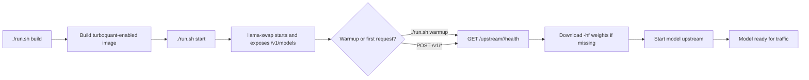

# easy llama(cpp)

GPU-focused multi-model llama.cpp runner with llama-swap as the only runtime entrypoint.

> Primary workflow: build one CUDA image, start one llama-swap container, and serve multiple model IDs from `config.yml` through OpenAI-compatible endpoints.

## Overview

- Build one CUDA image from llama.cpp, then run one llama-swap container.
- Keep credentials in `auth.json` and host assets in `models/`, `mmproj/`, and `chat_template/`.
- Serve chat, embedding, completion, and rerank routes from one config file on `http://127.0.0.1:8080` by default.
- Warm models explicitly with `./run.sh warmup` when you want downloads and first loads to happen before user traffic.

## Contents

- [Overview](#overview)
- [Requirements](#requirements)
- [Quick Start](#quick-start)
- [Architecture](#architecture)
- [Build and Warmup Flow](#build-and-warmup-flow)
- [Served Models and Endpoints](#served-models-and-endpoints)
- [Command Reference](#command-reference)
- [Configuration](#configuration)
- [Authentication and API Keys](#authentication-and-api-keys)
- [mmproj Integration](#mmproj-integration)
- [API Examples](#api-examples)
- [Runtime Behavior](#runtime-behavior)
- [Troubleshooting](#troubleshooting)
- [Contributing](#contributing)
- [License](#license)

## Requirements

- Docker with the daemon running
- NVIDIA container runtime available in Docker
- NVIDIA driver and `nvidia-smi` on the host
- `jq` for auth/config parsing

## Quick Start

1. Build the local CUDA image.

```bash
./run.sh build
```

By default this builds `TheTom/llama-cpp-turboquant@feature/turboquant-kv-cache`. Override that with `LLAMACPP_LLAMA_CPP_REPO` and `LLAMACPP_LLAMA_CPP_REF` if you need a different fork or branch.

If you want a local editable runtime config, copy the tracked example first:

```bash
cp config.yml.example config.yml
```

1. Start the swap runtime.

```bash
./run.sh start
```

`./run.sh start` advertises configured model IDs but does not pre-download every `-hf` model into `models/`.

1. Optionally warm the models you want ready before traffic arrives.

```bash
./run.sh warmup qwen3-chat qwen3-embeddings qmd-rerank
```

1. Verify that the service is up and advertising models.

```bash
./run.sh status
curl -sS http://127.0.0.1:8080/health
curl -sS http://127.0.0.1:8080/v1/models | jq '.data[].id'
```

The tracked example config exposes these model IDs:

```text
qwen3-chat
qwen3-embeddings
qmd-generate
qmd-embed
qmd-rerank
```

## Architecture

```text
Client requests -> Port 8080
                   |
             +-----+------+
             | llama-swap |
             | proxy      |
             +-----+------+
                   |
  +------------+------------+
  |            |            |
  v            v            v
 +-----------+ +-----------+ +-----------+
 | chat or   | | embedding | | reranker  |
 | completion| | model     | | model     |
 +-----------+ +-----------+ +-----------+
```

The container runs llama-swap on the public port and spawns upstream `llama-server` processes per configured model when requests arrive.
That upstream can be a chat model, embedding model, or a dedicated reranker depending on the model ID you request.

## Build and Warmup Flow



Read it as: build the turboquant image, start llama-swap, then either warm a model explicitly or let the first authenticated request trigger the same load path.

## Served Models and Endpoints

### Model IDs

| Model ID | Underlying Model | Purpose |
| --- | --- | --- |
| `qwen3-chat` | `HauhauCS/Qwen3.6-27B-Uncensored-HauhauCS-Aggressive:Q5_K_P` | Primary chat and reasoning model |
| `qwen3-embeddings` | `Qwen/Qwen3-Embedding-8B-GGUF:Q5_K_M` | Dense embeddings for vector search and similarity |
| `qmd-generate` | `tobil/qmd-query-expansion-1.7B-gguf:Q8_0` | QMD query expansion and OpenAI-compatible completions |
| `qmd-embed` | `Qwen/Qwen3-Embedding-8B-GGUF:Q5_K_M` | QMD embedding alias for `/v1/embeddings` |
| `qmd-rerank` | `mradermacher/Qwen3-Reranker-8B-GGUF:Q5_K_M` | Cross-encoder reranker for `/v1/rerank` |

### Exposed Endpoints

| Endpoint | Purpose |
| --- | --- |
| `GET /health` | Health check |
| `GET /v1/models` | List available model IDs |
| `POST /v1/chat/completions` | Chat completions |
| `POST /v1/completions` | Legacy completions |
| `POST /v1/responses` | Responses API |
| `POST /v1/embeddings` | Embedding generation |
| `POST /v1/rerank` | Cross-encoder reranking |
| `GET /ui` | Built-in llama-swap web UI |

`qmd-rerank` is a reranker-only model. Use it with `/v1/rerank`, not the chat or completions routes.

## Command Reference

| Command | Scope | Description |
| --- | --- | --- |
| `./run.sh build` | host | Build the local CUDA image from the Dockerfile |
| `./run.sh start` | host | Start the llama-swap container |
| `./run.sh warmup [model...]` | host or container | Load configured models through llama-swap's internal upstream route without waiting for a user inference request |
| `./run.sh stop` | host | Stop and remove the container |
| `./run.sh restart` | host | Restart the runtime |
| `./run.sh status` | host | Show container status |
| `./run.sh logs` | host | Follow container logs |
| `./run.sh clean` | host | Remove the container and image |
| `./run.sh help` | host | Show supported commands and env vars |
| `./run.sh serve` | container | Run llama-swap directly as the image entrypoint |

For normal host usage, `build`, `start`, `warmup`, `status`, `logs`, `restart`, and `stop` are the commands that matter day to day.

## Configuration

### Core Files and Directories

| Path | Purpose |
| --- | --- |
| `config.yml` | Local llama-swap config for runtime overrides and edits |
| `config.yml.example` | Tracked template for the local runtime config |
| `auth.json` | Local Hugging Face token and optional API key |
| `auth.json.example` | Template for local credentials |
| `models/` | Cached Hugging Face model data |
| `mmproj/` | Local or downloaded multimodal projector files |
| `chat_template/` | Mounted chat template files used by upstream servers |

### Common Environment Overrides

| Variable | Purpose |
| --- | --- |
| `LLAMACPP_LS_CONFIG_FILE` | Use a different llama-swap YAML file |
| `LLAMACPP_AUTH_FILE` | Use a different auth JSON file |
| `LLAMACPP_HOST_PORT` | Change the exposed host port |
| `LLAMACPP_CONTAINER_PORT` | Change the internal listen port |
| `LLAMACPP_LLAMA_CPP_REPO` | Choose which llama.cpp repo to build |
| `LLAMACPP_LLAMA_CPP_REF` | Choose which repo ref or branch to build |
| `LLAMACPP_CMAKE_CUDA_ARCHITECTURES` | Override CUDA arch detection |
| `LLAMACPP_MMPROJ_FILE` | Provide a projector path or URL |
| `LLAMACPP_HF_MMPROJ` | Provide a projector as `owner/repo/file.gguf` |
| `HF_TOKEN` / `LLAMACPP_HF_TOKEN` | Override the Hugging Face token |
| `LLAMACPP_API_KEY` / `API_KEY` | Protect `/v1/*` endpoints with an API key |

To use a different config file:

```bash
LLAMACPP_LS_CONFIG_FILE=/path/to/custom.yaml ./run.sh start
```

Without an override, `run.sh` looks for `config.yml` first and falls back to `config.yml.example`.

To build from a different llama.cpp fork or branch:

```bash
LLAMACPP_LLAMA_CPP_REPO=https://github.com/ggml-org/llama.cpp.git \
LLAMACPP_LLAMA_CPP_REF=master \
./run.sh build
```

## Authentication and API Keys

Create `auth.json` from `auth.json.example` and set your local credentials:

```json
{
  "hf_token": "hf_...",
  "api_key": "your-local-endpoint-key"
}
```

### Hugging Face Token Precedence

1. `HF_TOKEN`
1. `LLAMACPP_HF_TOKEN`
1. `auth.json` or `LLAMACPP_AUTH_FILE`
1. `auth.json.example`

### Local API Key Precedence

1. `LLAMACPP_API_KEY`
1. `API_KEY`
1. `auth.json` `api_key` field or `LLAMACPP_AUTH_FILE`

When an API key is set, `run.sh` generates an effective llama-swap config with top-level `apiKeys` enabled, so `/v1/*` endpoints require either `Authorization: Bearer <api_key>` or `x-api-key`.

## mmproj Integration

Optional multimodal projector handling is built in.

- Use `LLAMACPP_MMPROJ_FILE` for a local path, a path under `mmproj/`, or a direct URL.
- Use `LLAMACPP_HF_MMPROJ` for `owner/repo/file.gguf` shorthand.

`run.sh` resolves the projector, downloads URL sources into `mmproj/` when needed, and exports `LLAMACPP_MMPROJ_ARG` for `config.yml` macros to consume.

## API Examples

### List Models

```bash
curl -sS http://127.0.0.1:8080/v1/models | jq '.data[].id'
```

### Chat Completions

```bash
curl -X POST http://127.0.0.1:8080/v1/chat/completions \
  -H "Content-Type: application/json" \
  -d '{
    "model": "qwen3-chat",
    "messages": [
      {"role": "user", "content": "Hello!"}
    ],
    "stream": true
  }'
```

### Embeddings

```bash
curl -X POST http://127.0.0.1:8080/v1/embeddings \
  -H "Content-Type: application/json" \
  -d '{
    "model": "qwen3-embeddings",
    "input": ["Hello world", "Another document"]
  }'
```

### Rerank

```bash
curl -X POST http://127.0.0.1:8080/v1/rerank \
  -H "Content-Type: application/json" \
  -d '{
    "model": "qmd-rerank",
    "query": "best local reranker for QMD search",
    "top_n": 2,
    "documents": [
      "Qwen3 Reranker 8B is a cross-encoder reranker served through /v1/rerank.",
      "Qwen3 Embeddings 8B creates vectors for retrieval, not pairwise reranking.",
      "QMD Query Expansion rewrites search prompts before retrieval and reranking."
    ]
  }'
```

## Runtime Behavior

### Model Loading and Swapping

By default llama-swap runs one upstream model at a time.

The key runtime rules are simple:

- Entries under `models:` are registered at startup, but `-hf ...` assets are downloaded lazily on first use.
- `./run.sh warmup` forces that first load early by calling `GET /upstream/<model>/health` through llama-swap.
- With no arguments, warmup uses the model IDs returned by `/v1/models`; with arguments, it warms only the named IDs.
- If you want preloading at startup instead of an explicit command, use `hooks.on_startup.preload` in `config.yml`.

If you preload multiple models at once, put them in the same concurrent group or matrix set or they will swap each other out during startup.

1. If no model is loaded, the requested model starts immediately.
1. If another model is loaded, llama-swap unloads it and starts the requested one.
1. Waiting requests queue until the requested model is ready.

For concurrent multi-model serving, add a `matrix:` block to `config.yml` if your GPU memory budget allows it.

```yaml
matrix:
  vars:
    c: qwen3-chat
    e: qwen3-embeddings
  sets:
    dual: "c & e"
```

With a ~27B chat model plus an 8B embedding model, expect high VRAM requirements if both stay resident.

### Web UI

Open the built-in llama-swap interface at:

```text
http://127.0.0.1:8080/ui
```

It provides:

- a lightweight playground
- request and response inspection
- model load and unload controls
- live runtime metrics and logs

## Troubleshooting

| Symptom | Likely Cause | Fix |
| --- | --- | --- |
| `/app/bin/llama-swap` missing | The image was built before llama-swap support was present or the image is stale | Run `./run.sh clean && ./run.sh build` |
| Configured models are not downloaded after `./run.sh start` | Model downloads are lazy and only begin on the first authenticated request for that model | Run `./run.sh warmup [model...]` or send an authorized request to the target `/v1/*` route, then watch `models/` or `./run.sh logs` for the initial cache population |
| `/v1/models` returns `401` | An API key is configured via `auth.json`, `LLAMACPP_AUTH_FILE`, `LLAMACPP_API_KEY`, or `API_KEY` | Retry with `Authorization: Bearer <api_key>` or `x-api-key: <api_key>` |
| First embeddings request is slow | The embedding model is being downloaded on first use | Watch `./run.sh logs` and wait for the initial cache to populate |
| Port `8080` is busy | Another process is already bound to the host port | Start with `LLAMACPP_HOST_PORT=8090 ./run.sh start` |
| `turbo4` cache types fail | The selected llama.cpp repo/ref does not support those cache types | Build with the default turboquant fork or change the cache settings in `config.yml` |

Example rebuild with the default turbo-cache-compatible fork:

```bash
LLAMACPP_LLAMA_CPP_REPO=https://github.com/TheTom/llama-cpp-turboquant.git \
LLAMACPP_LLAMA_CPP_REF=feature/turboquant-kv-cache \
./run.sh build
./run.sh restart
```

## Contributing

Thanks for contributing to easy llama(cpp).

### Before You Start

- Keep changes focused.
- Update the README when behavior or configuration changes.
- Never commit secrets or local-only credentials.

### Local Setup

1. Ensure requirements are installed: Docker, NVIDIA runtime, and `jq`.
1. Create local credentials from the auth template.

```bash
cp auth.json.example auth.json
```

If testing turbo cache types, set `LLAMACPP_LLAMA_CPP_REPO` and `LLAMACPP_LLAMA_CPP_REF` to a compatible fork and rebuild.

1. Enable the repo hooks.

```bash
git config core.hooksPath .githooks
chmod +x .githooks/pre-commit
```

### Validation

Run the narrowest checks that match your change. For shell or runtime work, start with:

```bash
bash -n run.sh
./run.sh build
./run.sh restart
curl -sS http://127.0.0.1:8080/health
curl -sS http://127.0.0.1:8080/v1/models | jq '.data[].id'
```

### Pull Request Checklist

- Explain what changed and why.
- Include the validation steps you ran and the relevant output.
- Call out any config, env var, or model behavior changes.
- Commit only `auth.json.example`, never real credentials.

## License

GPL-3.0-only. See [LICENSE](LICENSE).
