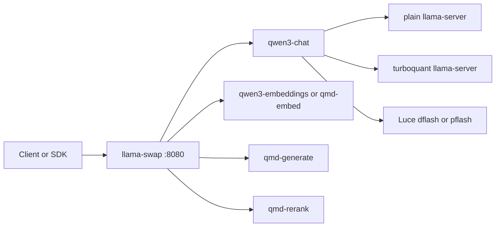

# easy llama(cpp)

Local GPU runner for llama.cpp, turboquant, and Luce dflash/pflash with one public entrypoint: `llama-swap` on `http://127.0.0.1:8080`.

`run.sh` is still the command users touch. Under the hood it dispatches to the `easyllama` Python package, builds a mode-specific CUDA image, and starts one `llama-swap` container that keeps the public API stable while swapping backend implementations underneath.

## Table of Contents

- [Overview](#overview)
- [Release Highlights](#release-highlights)
- [Upgrade Notes](#upgrade-notes)
- [Runtime Layout](#runtime-layout)
- [Modes](#modes)
- [Requirements](#requirements)
- [Quick Start](#quick-start)
- [Commands](#commands)
- [Files and Config](#files-and-config)
- [Models and Endpoints](#models-and-endpoints)
- [API Examples](#api-examples)
- [Troubleshooting](#troubleshooting)
- [Contributing](#contributing)
- [License](#license)

## Overview

easy llama(cpp) gives you one host workflow for three serving styles:

- `basic`: plain `llama-server`
- `turboquant`: turboquant-enabled `llama-server`
- `lucebox`: Luce dflash/pflash for `qwen3-chat`, plain `llama-server` for the other models

What stays the same in every mode:

- One public port: `8080`
- One host command surface: `./run.sh`
- One runtime proxy: `llama-swap`
- One shared Hugging Face cache under `models/`
- One shared place for mmproj assets under `mmproj/`
- One stable set of model IDs exposed through `/v1/models`

Downloads are lazy by default. The first request for a model will fetch weights if they are not already present in `models/`. If you want predictable first-request latency, warm the models explicitly before you send traffic.

## Release Highlights

- The runtime is now a real Python package under `easyllama/`, with `run.sh` kept as the single user-facing entrypoint.
- Builds are mode-specific and BuildKit-backed, so `basic` no longer drags in turboquant or Lucebox artifacts.
- The repo now ships one config template per mode instead of one overloaded `config.yml.example`.
- The current default configs were smoke-tested end to end.
- `basic` was validated on `GET /health`, `GET /v1/models`, `POST /v1/chat/completions`, `POST /v1/completions`, `POST /v1/responses`, `POST /v1/embeddings`, and `POST /v1/rerank`.
- `turboquant` was validated on the same routes as `basic`.
- `lucebox` was validated on the same routes plus `POST /v1/messages`.

## Upgrade Notes

- `config.yml.example` has been replaced by `config.basic.yml.example`, `config.turboquant.yml.example`, and `config.lucebox.yml.example`.
- `./run.sh` still works as the top-level entrypoint, but it now dispatches into the `easyllama` package.
- Each mode builds its own local image tag, for example `llamacpp-local:cuda13-basic` or `llamacpp-local:cuda13-lucebox`.
- If you change Python runtime code under `easyllama/`, rebuild the affected mode image before testing. The runtime code is baked into the image; it is not bind-mounted from the host.

## Runtime Layout



In `lucebox` mode only the `qwen3-chat` path moves to Luce. The embedding, generation, and rerank helpers still run through plain `llama-server` style upstreams.

## Modes

| Mode | Best for | `qwen3-chat` backend | Default chat weights | Extra API surface |
| --- | --- | --- | --- | --- |
| `basic` | Simplest plain llama.cpp path | `llama-server-basic` | `unsloth/Qwen3.6-27B-GGUF:Q4_K_M` | none |
| `turboquant` | Turboquant KV-cache experiments | `llama-server-turboquant` | `HauhauCS/Qwen3.6-27B-Uncensored-HauhauCS-Aggressive:Q5_K_P` | none |
| `lucebox` | Luce dflash/pflash chat serving | `easyllama server lucebox` | `unsloth/Qwen3.6-27B-GGUF:Q4_K_M` plus `KingsonHO/Qwen3.6-27B-DFlash:model.safetensors` | `POST /v1/messages` |

Use `basic` when you want the least surprising path. Use `turboquant` when you specifically want the turboquant backend and cache types. Use `lucebox` when you want the Luce chat path while keeping the rest of the public API on the same port.

## Requirements

- Docker with the daemon running
- `docker buildx`
- NVIDIA drivers on the host and a working `nvidia-smi`
- NVIDIA container runtime available in Docker
- Python `3.11+` on the host
- `curl` and `jq`

Minimal host setup for running `./run.sh` from a checkout:

```bash
python3 -m venv .venv
.venv/bin/python -m pip install docker colorama
```

Full editable development install:

```bash
python3 -m venv .venv
.venv/bin/python -m pip install -e . -r requirements-dev.txt
```

`run.sh` looks for `.venv/bin/easyllama` first, then `/opt/venv/bin/easyllama`, then a globally installed `easyllama`, then falls back to `python -m easyllama` from the repo checkout.

## Quick Start

### 1. Create credentials

```bash
cp auth.json.example auth.json
```

Set `hf_token` for private or rate-limited Hugging Face pulls. Set `api_key` if you want `/v1/*` endpoints protected by `Authorization: Bearer ...`.

### 2. Pick a mode config

```bash
cp config.basic.yml.example config.basic.yml
cp config.turboquant.yml.example config.turboquant.yml
cp config.lucebox.yml.example config.lucebox.yml
```

If you do not create an active config, `run.sh` falls back to the matching example file. Copy the example when you want local edits that should survive future template updates.

### 3. Build, start, and warm a mode

`basic`:

```bash
./run.sh build
./run.sh start
./run.sh warmup qwen3-chat qwen3-embeddings qmd-generate qmd-rerank
```

`turboquant`:

```bash
./run.sh --mode turboquant build
./run.sh --mode turboquant start
./run.sh --mode turboquant warmup qwen3-chat qwen3-embeddings qmd-generate qmd-rerank
```

`lucebox`:

```bash
./run.sh --mode lucebox build
./run.sh --mode lucebox start
./run.sh --mode lucebox warmup qwen3-chat qwen3-embeddings qmd-generate qmd-rerank
```

With no model arguments, `./run.sh warmup` warms every model currently exposed by `/v1/models`.

### 4. Verify the runtime

```bash
API_KEY="$(jq -r '.api_key // empty' auth.json)"
AUTH=()
if [[ -n "${API_KEY}" ]]; then
  AUTH=(-H "Authorization: Bearer ${API_KEY}")
fi

./run.sh status
curl -sS http://127.0.0.1:8080/health | jq
curl -sS "${AUTH[@]}" http://127.0.0.1:8080/v1/models | jq -r '.data[].id'
```

## Commands

| Command | What it does |
| --- | --- |
| `./run.sh build` | Build the default `basic` image |
| `./run.sh --mode <mode> build` | Build the selected mode image |
| `./run.sh start` | Start the default `basic` container |
| `./run.sh --mode <mode> start` | Start a specific mode |
| `./run.sh warmup [model...]` | Warm one or more configured models through llama-swap |
| `./run.sh restart` | Restart the selected mode container |
| `./run.sh stop` | Stop and remove the runtime container |
| `./run.sh logs` | Follow runtime logs |
| `./run.sh status` | Show runtime container status and available mode images |
| `./run.sh clean` | Remove the current mode image and container |
| `./run.sh clean --all-images` | Remove all mode images plus the runtime container |
| `./run.sh serve` | Run llama-swap inside the container |
| `./run.sh server ...` | Run a mode-specific upstream server directly; useful for advanced debugging |
| `./run.sh help` | Show the CLI surface |

## Files and Config

| Path | Purpose |
| --- | --- |
| `run.sh` | Thin host and container entrypoint |
| `auth.json` | Local Hugging Face token and optional API key |
| `auth.json.example` | Credential template |
| `config.basic.yml` | Editable config for `basic` |
| `config.turboquant.yml` | Editable config for `turboquant` |
| `config.lucebox.yml` | Editable config for `lucebox` |
| `config.basic.yml.example` | Tracked `basic` template |
| `config.turboquant.yml.example` | Tracked `turboquant` template |
| `config.lucebox.yml.example` | Tracked `lucebox` template |
| `models/` | Shared Hugging Face cache |
| `mmproj/` | Host-side mmproj assets |
| `chat_template/` | Mounted chat templates |
| `easyllama/` | Python runtime, CLI, Docker orchestration, and server launchers |

Common environment overrides:

| Variable | Purpose |
| --- | --- |
| `LLAMACPP_MODE` | Select `basic`, `turboquant`, or `lucebox` |
| `LLAMACPP_LS_CONFIG_FILE` | Override mode-based config selection with an explicit file |
| `LLAMACPP_HOST_PORT` | Change the published host port |
| `LLAMACPP_AUTH_FILE` | Point to a different auth JSON file |
| `HF_TOKEN` or `LLAMACPP_HF_TOKEN` | Override the Hugging Face token |
| `API_KEY` or `LLAMACPP_API_KEY` | Override the local API key |
| `LLAMACPP_MMPROJ_FILE` | Provide a local mmproj path, `mmproj/...`, or URL |
| `LLAMACPP_HF_MMPROJ` | Provide an mmproj asset as `owner/repo/file.gguf` |
| `LLAMACPP_CMAKE_CUDA_ARCHITECTURES` | Override auto-detected CUDA arch values during build |

Notes:

- If `auth.json` contains `api_key`, `easyllama` injects that into the effective llama-swap config so `/v1/*` routes require a bearer token.
- If exactly one `*.gguf` file exists under `mmproj/` and you do not set an override, `easyllama` will auto-select it.
- `LLAMACPP_LS_CONFIG_FILE` bypasses the mode-specific config file names entirely.

## Models and Endpoints

### Default model IDs

| Model ID | Purpose | Default source |
| --- | --- | --- |
| `qwen3-chat` | Primary chat model | mode-dependent |
| `qwen3-embeddings` | Dense embeddings | `Qwen/Qwen3-Embedding-8B-GGUF:Q5_K_M` |
| `qmd-generate` | Query expansion and text generation | `tobil/qmd-query-expansion-1.7B-gguf:Q8_0` |
| `qmd-embed` | Embedding alias for QMD | `Qwen/Qwen3-Embedding-8B-GGUF:Q5_K_M` |
| `qmd-rerank` | Cross-encoder reranking | `mradermacher/Qwen3-Reranker-8B-GGUF:Q5_K_M` |

`qwen3-chat` defaults by mode:

- `basic`: `unsloth/Qwen3.6-27B-GGUF:Q4_K_M`
- `turboquant`: `HauhauCS/Qwen3.6-27B-Uncensored-HauhauCS-Aggressive:Q5_K_P`
- `lucebox`: `unsloth/Qwen3.6-27B-GGUF:Q4_K_M` as target plus `KingsonHO/Qwen3.6-27B-DFlash:model.safetensors` as draft weights

### Endpoint matrix

| Endpoint | `basic` | `turboquant` | `lucebox` | Notes |
| --- | --- | --- | --- | --- |
| `GET /health` | yes | yes | yes | Runtime health |
| `GET /v1/models` | yes | yes | yes | Lists model IDs |
| `POST /v1/chat/completions` | yes | yes | yes | Use `qwen3-chat` |
| `POST /v1/messages` | no | no | yes | Lucebox-only messages route |
| `POST /v1/completions` | yes | yes | yes | Best fit for `qmd-generate` |
| `POST /v1/responses` | yes | yes | yes | Use `qmd-generate` |
| `POST /v1/embeddings` | yes | yes | yes | Use `qwen3-embeddings` or `qmd-embed` |
| `POST /v1/rerank` | yes | yes | yes | Use `qmd-rerank` |
| `GET /ui` | yes | yes | yes | Built-in llama-swap UI |

Notes:

- `qmd-rerank` is rerank-only.
- `qmd-generate` is the text-generation model for `/v1/completions` and `/v1/responses`.
- `POST /v1/messages` is only meaningful in `lucebox` mode.

## API Examples

The snippets below assume Bash. If API key protection is enabled, define the header once:

```bash
API_KEY="$(jq -r '.api_key // empty' auth.json)"
AUTH=()
if [[ -n "${API_KEY}" ]]; then
  AUTH=(-H "Authorization: Bearer ${API_KEY}")
fi
```

### List models

```bash
curl -sS "${AUTH[@]}" http://127.0.0.1:8080/v1/models | jq -r '.data[].id'
```

### Chat completions

```bash
curl -sS "${AUTH[@]}" \
  -H 'Content-Type: application/json' \
  -d '{
    "model": "qwen3-chat",
    "messages": [{"role": "user", "content": "Reply with exactly ok."}],
    "max_tokens": 16,
    "stream": false
  }' \
  http://127.0.0.1:8080/v1/chat/completions | jq
```

### Messages (`lucebox` only)

```bash
curl -sS "${AUTH[@]}" \
  -H 'Content-Type: application/json' \
  -d '{
    "model": "qwen3-chat",
    "messages": [{"role": "user", "content": "Reply with exactly ok."}],
    "max_tokens": 16,
    "stream": false
  }' \
  http://127.0.0.1:8080/v1/messages | jq
```

### Responses

```bash
curl -sS "${AUTH[@]}" \
  -H 'Content-Type: application/json' \
  -d '{
    "model": "qmd-generate",
    "input": "Reply with exactly ok.",
    "max_output_tokens": 16
  }' \
  http://127.0.0.1:8080/v1/responses | jq
```

### Embeddings

```bash
curl -sS "${AUTH[@]}" \
  -H 'Content-Type: application/json' \
  -d '{
    "model": "qwen3-embeddings",
    "input": "local llama embeddings smoke test"
  }' \
  http://127.0.0.1:8080/v1/embeddings | jq
```

### Rerank

```bash
curl -sS "${AUTH[@]}" \
  -H 'Content-Type: application/json' \
  -d '{
    "model": "qmd-rerank",
    "query": "best local reranker for qmd search",
    "documents": [
      "Qwen3 Reranker 8B is a cross-encoder reranker served through /v1/rerank.",
      "Qwen3 Embeddings 8B creates vectors for retrieval, not pairwise reranking.",
      "QMD Query Expansion rewrites search prompts before retrieval and reranking."
    ]
  }' \
  http://127.0.0.1:8080/v1/rerank | jq
```

## Troubleshooting

| Problem | Likely cause | What to do |
| --- | --- | --- |
| `docker buildx` build fails immediately | Buildx is missing or not bootstrapped | Install Buildx and run `docker buildx inspect --bootstrap` |
| First request is slow | Model download or first load is happening lazily | Run `./run.sh warmup ...` first |
| `POST /v1/messages` fails | You are not in `lucebox` mode | Restart with `./run.sh --mode lucebox start` |
| `/v1/models` returns `401` | API key is enabled | Send `Authorization: Bearer <api_key>` |
| A config edit does nothing | You changed the wrong mode file or are using `LLAMACPP_LS_CONFIG_FILE` | Check the active mode and config path |
| A Python change seems ignored | The running image is stale | Rebuild that mode with `./run.sh --mode <mode> build` and restart it |
| Port `8080` is busy | Something else owns the host port | Start with `LLAMACPP_HOST_PORT=8090 ./run.sh start` |
| Private HF downloads fail | No usable HF token is available | Set `hf_token` in `auth.json` or export `HF_TOKEN` |

## Contributing

Keep changes focused. If behavior, config shape, or endpoint coverage changes, update this README and the relevant `config.*.yml.example` file in the same change.

Helpful validation commands:

```bash
bash -n run.sh
.venv/bin/python -m ruff check easyllama
.venv/bin/python -m ruff format --check easyllama
.venv/bin/python -m compileall easyllama
./run.sh help
```

For runtime-facing changes, rebuild the affected mode image, restart it, then hit at least `GET /health` and `GET /v1/models` before merging.

## License

See [LICENSE](LICENSE).
